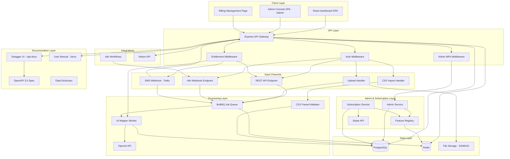
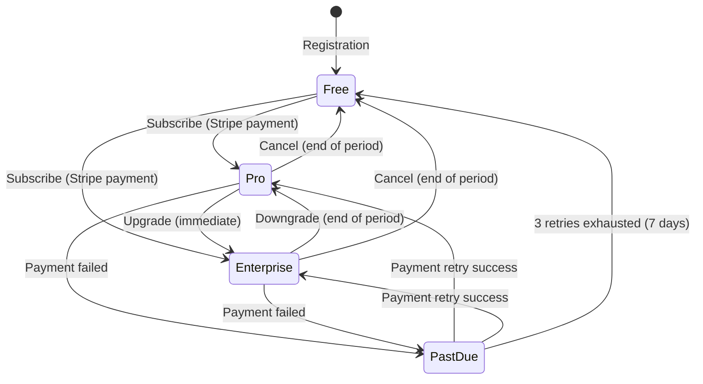

# Design Document: AI Mapping Web App (MindAtlas)

## Overview

MindAtlas is a full-stack web application that enables users to capture content from multiple input channels (REST API, SMS, web upload), automatically categorize and map relationships between items using AI, and present an organized view through a card-based dashboard interface. The system is containerized with Docker and deployed via GitHub Actions CI/CD.

The architecture follows a modular monolith pattern with clearly separated domains: authentication, item ingestion, AI processing, dashboard rendering, third-party integrations, admin management, and subscription/billing. This approach balances development velocity for a single-team product with clean service boundaries that could evolve into microservices if needed.

**Key Technical Decisions:**
- **Backend**: Node.js with Express.js — strong async I/O for handling multiple input channels, rich ecosystem for integrations
- **Frontend**: React with TypeScript — component-based architecture suits the card/grid dashboard, strong typing for data models
- **Database**: PostgreSQL — relational integrity for user/item ownership, JSON columns for flexible item metadata
- **AI Processing**: OpenAI API with queue-based async processing — decouples item creation from AI analysis
- **SMS Gateway**: Twilio — established SMS API with webhook support
- **Task Queue**: BullMQ (Redis-backed) — handles AI processing jobs, retries, and rate limiting
- **Payment Processing**: Stripe — industry-standard subscription billing with webhooks for real-time payment events
- **Feature Entitlements**: Runtime-configurable feature registry with Redis-cached entitlements — admin changes propagate immediately without deploys
- **Admin Security**: Role-based access with mandatory MFA, structurally isolated from user content at the data access layer

## Architecture



### Request Flow

1. **Item Ingestion**: All input channels (API, SMS, Web Upload, Webhook) validate and normalize incoming content, then enqueue an AI processing job
2. **Entitlement Check**: Before processing, the entitlement middleware verifies the user's plan includes the requested feature (input channel, AI capability, integration). Returns 402 if not entitled.
3. **CSV Bulk Import**: CSV uploads are validated for structure/size, parsed row-by-row, items created in batch, then each enqueued for AI processing
4. **AI Processing**: BullMQ workers pick up jobs, call OpenAI for categorization/tagging/relationship mapping, and persist results to PostgreSQL
5. **Dashboard Retrieval**: React SPA fetches processed items and maps via authenticated API calls, renders the card grid and relationship graphs
6. **Documentation Serving**: Static routes serve Swagger UI at `/api-docs` (backed by OpenAPI YAML spec) and rendered user manual at `/docs` (backed by markdown files)
7. **Admin Operations**: Admin requests pass through admin MFA middleware, then admin service layer serves user management, metrics, plan management, and moderation — never exposing card content
8. **Subscription & Billing**: Stripe webhooks update payment status; subscription service manages plan transitions and feature entitlements read from admin-configured runtime config

### Security Architecture

- JWT access tokens (15-minute expiry) with refresh tokens (7-day expiry)
- bcrypt password hashing (cost factor 12)
- TLS 1.2+ enforced at the reverse proxy/load balancer level
- AES-256-GCM encryption for item content at rest
- Input sanitization via DOMPurify (frontend) and express-validator + parameterized queries (backend)
- Rate limiting via Redis-backed sliding window (100 req/min per user)
- **Strict user data isolation**: All data queries are scoped by authenticated user ID at the service layer. One user's items, maps, tags, and relationships are never visible to or accessible by another user. The dashboard only renders the authenticated user's content.
- **Admin content isolation**: The admin service layer deliberately omits encrypted item content from all queries and responses. Admin endpoints never join on or return `content_encrypted` fields. Even with full database access, the admin API layer structurally prevents card content exposure.
- **Entitlement enforcement**: A dedicated middleware checks feature entitlements on every feature-gated API call before reaching the handler. Entitlements are read from admin-configured plan definitions cached in Redis, updated immediately when admin changes config.

## Components and Interfaces

### Backend Components

#### Auth Service (`/src/services/auth/`)

| Method | Signature | Description |
|--------|-----------|-------------|
| `register` | `(email: string, password: string) => Promise<User>` | Creates a new user account with hashed password |
| `login` | `(email: string, password: string) => Promise<{accessToken, refreshToken}>` | Authenticates user, issues JWT pair |
| `refresh` | `(refreshToken: string) => Promise<{accessToken}>` | Issues new access token from valid refresh token |
| `validatePassword` | `(password: string) => ValidationResult` | Checks password complexity requirements |
| `lockAccount` | `(userId: string) => Promise<void>` | Locks account after 5 failed attempts |

#### Item Service (`/src/services/items/`)

**Data Isolation**: Every item query is scoped to the authenticated user's ID. The service enforces tenant isolation at the data access layer — all queries include a `WHERE user_id = :userId` clause. A user can never retrieve, list, modify, or delete items belonging to another user. This ensures one user's cards/entries never appear in another user's dashboard or API responses.

| Method | Signature | Description |
|--------|-----------|-------------|
| `createItem` | `(userId: string, input: ItemInput) => Promise<Item>` | Validates, stores item (scoped to userId), enqueues AI processing |
| `getItem` | `(userId: string, itemId: string) => Promise<Item>` | Retrieves item only if owned by userId, throws 403 otherwise |
| `listItems` | `(userId: string, filters: ItemFilters) => Promise<PaginatedItems>` | Lists only the authenticated user's items with search/filter/pagination |
| `deleteItem` | `(userId: string, itemId: string) => Promise<void>` | Soft-deletes item only if owned by userId |
| `getItemRelationships` | `(userId: string, itemId: string) => Promise<Relationship[]>` | Returns relationships for an item owned by userId |

#### AI Mapper Service (`/src/services/ai-mapper/`)

**User Scoping**: The AI mapper only compares items within the same user's collection. Relationships are never created across user boundaries. Map generation is strictly per-user.

| Method | Signature | Description |
|--------|-----------|-------------|
| `categorizeItem` | `(item: Item) => Promise<CategoryResult>` | Assigns categories/tags with confidence scores |
| `mapRelationships` | `(item: Item, existingItems: Item[]) => Promise<Relationship[]>` | Identifies relationships only among items owned by the same user |
| `generateMap` | `(userId: string) => Promise<Map>` | Builds relationship map exclusively from the user's own items |
| `queryItems` | `(userId: string, query: string) => Promise<QueryResult>` | Natural language search scoped to user's items only |
| `suggestRelated` | `(userId: string, itemId: string) => Promise<Suggestion[]>` | Returns related items from the same user's collection |

#### SMS Gateway (`/src/services/sms/`)

| Method | Signature | Description |
|--------|-----------|-------------|
| `handleIncoming` | `(from: string, body: string) => Promise<void>` | Processes incoming SMS, creates item if registered |
| `sendReply` | `(to: string, message: string) => Promise<void>` | Sends SMS confirmation reply |
| `verifyPhoneNumber` | `(phoneNumber: string) => Promise<User | null>` | Looks up user by registered phone number |

#### Integration Service (`/src/services/integrations/`)

| Method | Signature | Description |
|--------|-----------|-------------|
| `handleWebhook` | `(apiKey: string, payload: WebhookPayload) => Promise<Item>` | Processes n8n webhook payloads |
| `connectNotion` | `(userId: string, oauthCode: string) => Promise<void>` | Establishes Notion OAuth connection |
| `importFromNotion` | `(userId: string, pageIds: string[]) => Promise<Item[]>` | Imports Notion pages as items |
| `exportToNotion` | `(userId: string, itemIds: string[]) => Promise<void>` | Exports items to connected Notion workspace |
| `generateApiKey` | `(userId: string, label: string) => Promise<ApiKey>` | Creates new API key for integrations |
| `revokeApiKey` | `(userId: string, keyId: string) => Promise<void>` | Revokes an API key |

#### CSV Service (`/src/services/csv/`)

**Purpose**: Handles bulk import of items via CSV file upload and export of items/maps to CSV format. Enforces size limits (10 MB / 5000 rows), validates CSV structure, and provides round-trip data fidelity.

| Method | Signature | Description |
|--------|-----------|-------------|
| `importCsv` | `(userId: string, fileBuffer: Buffer) => Promise<CsvImportResult>` | Validates, parses CSV, creates items in bulk. Returns summary of created/skipped rows |
| `validateCsvStructure` | `(headers: string[]) => ValidationResult` | Validates header row contains required "content" column and only recognized columns |
| `validateCsvSize` | `(fileSize: number, rowCount: number) => ValidationResult` | Enforces 10 MB and 5000 row limits |
| `parseRow` | `(row: Record<string, string>, rowIndex: number) => ParsedRow | SkippedRow` | Parses and validates individual row, returns parsed item data or skip reason |
| `exportItems` | `(userId: string) => Promise<Buffer>` | Generates CSV file with all user's items (content, content_type, tags, creation_date, metadata) |
| `exportMaps` | `(userId: string) => Promise<Buffer>` | Generates CSV file with relationship data (source_item_id, target_item_id, relationship_type, confidence_score) |
| `getTemplate` | `() => Buffer` | Returns a CSV template file with headers and example rows |

**CsvImportResult type**:
```typescript
interface CsvImportResult {
  itemsCreated: number;
  rowsSkipped: number;
  skippedRowNumbers: number[];
  errors: Array<{ row: number; reason: string }>;
}
```

#### Documentation Service (`/src/services/docs/`)

**Purpose**: Serves user manual content and OpenAPI specification. Handles markdown rendering for `/docs` route and Swagger UI configuration for `/api-docs`.

| Method | Signature | Description |
|--------|-----------|-------------|
| `serveManual` | `(section?: string) => Promise<RenderedMarkdown>` | Renders user manual markdown for the /docs route |
| `getOpenApiSpec` | `() => OpenAPIDocument` | Returns the parsed OpenAPI 3.0 YAML specification |
| `validateSpec` | `() => ValidationResult` | Validates the OpenAPI spec for syntactic correctness |

#### Admin Service (`/src/services/admin/`)

**Purpose**: Manages administrative operations including user management, system metrics, subscription plan configuration, feature entitlement management, moderation, and audit trail. **Critical constraint**: This service layer MUST NEVER query, join, or return the `content_encrypted` field from the ITEM table. All item-related queries in this service explicitly exclude content columns.

**Content Isolation Design**: The admin service uses a restricted data access layer (`AdminDataAccess`) that wraps PostgreSQL queries. This layer:
1. Uses a dedicated set of SQL views/query builders that omit `content_encrypted`, `file_path`, and any content-bearing fields
2. Queries against a read-only view `admin_user_summary` that only exposes aggregate counts, not item content
3. Logs and rejects any attempt to construct a query that would include content fields

| Method | Signature | Description |
|--------|-----------|-------------|
| `listUsers` | `(filters: AdminUserFilters) => Promise<PaginatedAdminUsers>` | Lists user accounts with metadata (email, registration date, plan, status) — never card content |
| `disableAccount` | `(adminId: string, userId: string, reason: string) => Promise<void>` | Disables a user account and logs to audit trail |
| `deleteAccount` | `(adminId: string, userId: string, reason: string) => Promise<void>` | Marks account for deletion and logs to audit trail |
| `unlockAccount` | `(adminId: string, userId: string) => Promise<void>` | Unlocks a locked user account |
| `getSystemMetrics` | `() => Promise<SystemMetrics>` | Returns aggregated system metrics (user counts, card counts, API volume, queue depth, error rates) |
| `createPlan` | `(adminId: string, plan: PlanInput) => Promise<SubscriptionPlan>` | Creates a new subscription plan definition |
| `updatePlan` | `(adminId: string, planId: string, changes: PlanUpdate) => Promise<SubscriptionPlan>` | Modifies plan attributes (limits, pricing) |
| `deactivatePlan` | `(adminId: string, planId: string) => Promise<void>` | Deactivates a plan (no new subscriptions) |
| `setFeatureEntitlements` | `(adminId: string, planId: string, features: FeatureToggle[]) => Promise<void>` | Toggles features on/off for a plan; updates cached entitlements immediately |
| `getFeatureRegistry` | `() => Promise<FeatureRegistryEntry[]>` | Returns all registered features with keys and descriptions |
| `moderateAccount` | `(adminId: string, userId: string, action: ModerationAction) => Promise<void>` | Flags/disables account for policy violation without exposing card content |
| `getAuditTrail` | `(filters: AuditFilters) => Promise<PaginatedAuditEntries>` | Returns admin action audit log |

**SystemMetrics type**:
```typescript
interface SystemMetrics {
  totalUsers: number;
  activeUsersDaily: number;
  activeUsersWeekly: number;
  activeUsersMonthly: number;
  totalCards: number;
  apiRequestVolume: { last24h: number; last7d: number };
  aiQueueDepth: number;
  errorRates: { last24h: number; last7d: number };
  subscriptionMetrics: {
    freeCount: number;
    proCount: number;
    enterpriseCount: number;
    mrr: number;
    churnRate: number;
    upgradeCount30d: number;
    downgradeCount30d: number;
  };
}
```

#### Subscription Service (`/src/services/subscription/`)

**Purpose**: Manages subscription plans, billing via Stripe, plan transitions, limit enforcement, and feature entitlement resolution. Integrates with the Feature Registry for runtime entitlement lookups.

| Method | Signature | Description |
|--------|-----------|-------------|
| `getUserSubscription` | `(userId: string) => Promise<UserSubscription>` | Returns user's current plan, limits, and billing status |
| `subscribeToPlan` | `(userId: string, planId: string, paymentMethodId: string) => Promise<UserSubscription>` | Creates a Stripe subscription and activates the plan immediately |
| `upgradePlan` | `(userId: string, newPlanId: string) => Promise<UserSubscription>` | Upgrades plan, prorates billing, activates new features immediately |
| `downgradePlan` | `(userId: string, newPlanId: string) => Promise<UserSubscription>` | Schedules downgrade at end of current billing period |
| `cancelSubscription` | `(userId: string) => Promise<void>` | Cancels subscription, maintains access until billing period end |
| `handleStripeWebhook` | `(event: StripeEvent) => Promise<void>` | Processes Stripe webhook events (payment success, failure, subscription updates) |
| `retryFailedPayment` | `(subscriptionId: string) => Promise<void>` | Retries a failed charge (up to 3 times over 7 days) |
| `checkEntitlement` | `(userId: string, featureKey: string) => Promise<EntitlementResult>` | Checks if user's plan includes the feature; returns allowed/denied |
| `checkStorageLimit` | `(userId: string) => Promise<StorageLimitResult>` | Checks if user has remaining storage capacity |
| `checkAiQueryLimit` | `(userId: string) => Promise<AiLimitResult>` | Checks if user has remaining AI queries for today |
| `getBillingHistory` | `(userId: string) => Promise<PaymentHistory[]>` | Returns user's payment history from Stripe |
| `updatePaymentMethod` | `(userId: string, paymentMethodId: string) => Promise<void>` | Updates user's default payment method in Stripe |

**EntitlementResult type**:
```typescript
interface EntitlementResult {
  allowed: boolean;
  featureKey: string;
  reason?: 'plan_not_included' | 'limit_exceeded' | 'subscription_expired';
  currentUsage?: number;
  limit?: number;
}
```

#### Feature Registry (`/src/services/feature-registry/`)

**Purpose**: Maintains a registry of all application features mapped to unique feature keys. Features auto-register on application startup. The registry is used by both the admin console (to show toggleable features) and the subscription service (to enforce entitlements).

**Auto-Registration Pattern**: Each feature module calls `FeatureRegistry.register()` during module initialization. This uses a decorator/annotation pattern:

```typescript
// Example: SMS input channel feature registration
@RegisterFeature({
  key: 'input.sms',
  name: 'SMS Input Channel',
  description: 'Receive items via SMS messages',
  category: 'input_channels'
})
class SmsGateway { ... }
```

| Method | Signature | Description |
|--------|-----------|-------------|
| `register` | `(feature: FeatureDefinition) => void` | Registers a feature with a unique key. Called at module init. |
| `getAll` | `() => FeatureRegistryEntry[]` | Returns all registered features (used by admin UI) |
| `getByKey` | `(key: string) => FeatureRegistryEntry | null` | Looks up a feature by its unique key |
| `getByCategory` | `(category: string) => FeatureRegistryEntry[]` | Returns features filtered by category |
| `isRegistered` | `(key: string) => boolean` | Checks if a feature key is registered |

**FeatureDefinition type**:
```typescript
interface FeatureDefinition {
  key: string;        // Unique key, e.g., 'input.sms', 'ai.relationship_mapping', 'integration.notion'
  name: string;       // Human-readable name
  description: string;
  category: 'input_channels' | 'ai_capabilities' | 'integrations' | 'export_formats' | 'advanced';
}
```

#### Entitlement Middleware (`/src/middleware/entitlement.ts`)

**Purpose**: Express middleware that intercepts feature-gated API requests and checks user entitlements before the request reaches the handler. Returns 402 Payment Required if the user's plan does not include the requested feature.

**Runtime Configuration**: Entitlements are read from a Redis-cached copy of admin-configured plan definitions. When an admin updates feature entitlements via the admin console, the cache is invalidated immediately, so changes take effect without code deployment.

```typescript
// Usage on routes:
router.post('/api/sms/incoming', requireEntitlement('input.sms'), smsHandler);
router.post('/api/ai/query', requireEntitlement('ai.natural_language'), aiQueryHandler);
router.post('/api/integrations/notion/connect', requireEntitlement('integration.notion'), notionHandler);
```

| Method | Signature | Description |
|--------|-----------|-------------|
| `requireEntitlement` | `(featureKey: string) => RequestHandler` | Returns middleware that checks the user's plan includes the feature |
| `loadEntitlements` | `(planId: string) => Promise<string[]>` | Loads entitled feature keys for a plan from Redis cache (falls back to DB) |
| `invalidateCache` | `(planId: string) => Promise<void>` | Invalidates cached entitlements when admin changes config |

### Frontend Components

#### Dashboard Layout (`/src/client/components/`)

| Component | Props | Description |
|-----------|-------|-------------|
| `Dashboard` | `{ user: User }` | Root layout with sidebar navigation and content area |
| `ItemGrid` | `{ items: Item[], layout: 'masonry' }` | Responsive masonry grid of item cards |
| `ItemCard` | `{ item: Item }` | Card showing thumbnail, title, snippet, tags, timestamp |
| `CategoryBadge` | `{ category: Category, color: string }` | Colored hashtag-style badge |
| `MapViewer` | `{ map: Map }` | Interactive graph visualization of item relationships |
| `SearchBar` | `{ onSearch: (filters) => void }` | Search/filter interface with category, tag, date controls |
| `ItemDetail` | `{ item: Item, related: Item[] }` | Full item view with relationships |
| `UploadForm` | `{ onSubmit: (input) => void }` | Multi-type item upload form |
| `BillingPage` | `{ subscription: UserSubscription }` | Billing management: current plan, payment history, upgrade/downgrade |
| `PlanSelector` | `{ plans: SubscriptionPlan[], current: string }` | Plan comparison and selection UI |
| `UsageMeter` | `{ usage: UsageData, limits: PlanLimits }` | Visual meters showing storage and AI query usage vs limits |

#### Admin Console Components (`/src/client/admin/`)

| Component | Props | Description |
|-----------|-------|-------------|
| `AdminLayout` | `{ admin: AdminUser }` | Admin console root layout with admin navigation sidebar |
| `AdminMfaGate` | `{ onVerified: () => void }` | MFA verification prompt before granting admin access |
| `UserManagement` | `{ users: AdminUserSummary[] }` | User list with disable/delete/unlock actions — no card content shown |
| `UserDetail` | `{ user: AdminUserSummary }` | User detail view (email, plan, status, registration date) — no card content |
| `SystemMetricsDashboard` | `{ metrics: SystemMetrics }` | Real-time system metrics display (users, cards, API volume, queue, errors) |
| `PlanManagement` | `{ plans: SubscriptionPlan[] }` | Create, modify, deactivate subscription plans |
| `FeatureEntitlementEditor` | `{ plan: SubscriptionPlan, features: FeatureRegistryEntry[] }` | Toggle features on/off for a specific plan |
| `ModerationPanel` | `{ flaggedUsers: AdminUserSummary[] }` | Account moderation: flag/disable for policy violations |
| `AuditTrailViewer` | `{ entries: AuditEntry[] }` | Filterable audit log of all admin actions |
| `SubscriptionMetrics` | `{ metrics: SubscriptionMetrics }` | Subscribers per tier, MRR, churn, upgrades/downgrades |

### API Endpoints

| Method | Path | Description |
|--------|------|-------------|
| POST | `/api/auth/register` | User registration |
| POST | `/api/auth/login` | User login |
| POST | `/api/auth/refresh` | Token refresh |
| GET | `/api/items` | List items (with filters) |
| POST | `/api/items` | Create item |
| GET | `/api/items/:id` | Get item details |
| DELETE | `/api/items/:id` | Delete item |
| GET | `/api/items/:id/relationships` | Get item relationships |
| GET | `/api/maps` | Get user's maps |
| POST | `/api/maps/regenerate` | Trigger map regeneration |
| POST | `/api/ai/query` | Natural language query |
| GET | `/api/ai/suggestions/:itemId` | Get suggestions for item |
| POST | `/api/webhooks/n8n` | n8n webhook endpoint |
| POST | `/api/integrations/notion/connect` | Connect Notion OAuth |
| POST | `/api/integrations/notion/import` | Import from Notion |
| POST | `/api/integrations/notion/export` | Export to Notion |
| GET | `/api/keys` | List API keys |
| POST | `/api/keys` | Generate API key |
| DELETE | `/api/keys/:id` | Revoke API key |
| POST | `/api/sms/incoming` | Twilio SMS webhook |
| POST | `/api/csv/import` | Import items from CSV file |
| GET | `/api/csv/export/items` | Export all items as CSV |
| GET | `/api/csv/export/maps` | Export map relationships as CSV |
| GET | `/api/csv/template` | Download CSV template file |
| GET | `/api-docs` | Interactive Swagger UI (OpenAPI 3.0) |
| GET | `/docs` | User manual documentation |
| GET | `/docs/:section` | Specific user manual section |
| **Admin Endpoints** | | |
| GET | `/api/admin/users` | List user accounts (no card content) |
| GET | `/api/admin/users/:id` | Get user detail (no card content) |
| POST | `/api/admin/users/:id/disable` | Disable a user account |
| POST | `/api/admin/users/:id/delete` | Mark user account for deletion |
| POST | `/api/admin/users/:id/unlock` | Unlock a locked account |
| GET | `/api/admin/metrics` | Get system metrics and analytics |
| GET | `/api/admin/metrics/subscriptions` | Get subscription-specific metrics |
| GET | `/api/admin/plans` | List all subscription plans |
| POST | `/api/admin/plans` | Create a new subscription plan |
| PUT | `/api/admin/plans/:id` | Update a subscription plan |
| POST | `/api/admin/plans/:id/deactivate` | Deactivate a subscription plan |
| GET | `/api/admin/plans/:id/entitlements` | Get feature entitlements for a plan |
| PUT | `/api/admin/plans/:id/entitlements` | Update feature entitlements for a plan |
| GET | `/api/admin/features` | Get all registered features |
| GET | `/api/admin/audit` | Get admin audit trail |
| POST | `/api/admin/moderate/:userId` | Flag/disable user for policy violation |
| **Billing Endpoints** | | |
| GET | `/api/billing/subscription` | Get current user's subscription details |
| POST | `/api/billing/subscribe` | Subscribe to a plan (Stripe checkout) |
| POST | `/api/billing/upgrade` | Upgrade to a higher plan |
| POST | `/api/billing/downgrade` | Downgrade to a lower plan |
| POST | `/api/billing/cancel` | Cancel subscription |
| GET | `/api/billing/history` | Get payment history |
| PUT | `/api/billing/payment-method` | Update payment method |
| GET | `/api/billing/usage` | Get current usage (storage, AI queries) |
| POST | `/api/webhooks/stripe` | Stripe webhook endpoint |
| GET | `/admin` | Admin Console SPA |

## Data Models

### Entity Relationship Diagram

```mermaid
erDiagram
    USER ||--o{ ITEM : owns
    USER ||--o{ API_KEY : has
    USER ||--o| NOTION_CONNECTION : connects
    USER ||--o| USER_SUBSCRIPTION : subscribes
    ITEM ||--o{ ITEM_TAG : has
    ITEM ||--o{ RELATIONSHIP : source
    ITEM ||--o{ RELATIONSHIP : target
    TAG ||--o{ ITEM_TAG : references
    CATEGORY ||--o{ TAG : contains
    MAP ||--o{ MAP_NODE : contains
    MAP ||--o{ MAP_EDGE : contains
    USER ||--o{ MAP : owns
    SUBSCRIPTION_PLAN ||--o{ PLAN_FEATURE_ENTITLEMENT : configures
    SUBSCRIPTION_PLAN ||--o{ USER_SUBSCRIPTION : has
    FEATURE_REGISTRY ||--o{ PLAN_FEATURE_ENTITLEMENT : references
    USER_SUBSCRIPTION ||--o{ PAYMENT_HISTORY : tracks
    ADMIN_ROLE ||--o{ ADMIN_USER : assigns

    USER {
        uuid id PK
        string email
        string password_hash
        string phone_number
        boolean is_locked
        timestamp locked_until
        int failed_attempts
        string role "user | admin"
        timestamp created_at
        timestamp updated_at
    }

    ITEM {
        uuid id PK
        uuid user_id FK
        string title
        text content_encrypted
        string content_type
        jsonb metadata
        string source_channel
        string source_domain
        string file_path
        int file_size
        boolean is_deleted
        timestamp deleted_at
        timestamp created_at
        timestamp updated_at
    }

    TAG {
        uuid id PK
        uuid category_id FK
        string name
        string color
    }

    CATEGORY {
        uuid id PK
        string name
        string color
    }

    ITEM_TAG {
        uuid item_id FK
        uuid tag_id FK
        float confidence_score
    }

    RELATIONSHIP {
        uuid id PK
        uuid source_item_id FK
        uuid target_item_id FK
        string relationship_type
        float strength
        timestamp created_at
    }

    MAP {
        uuid id PK
        uuid user_id FK
        string title
        jsonb layout_data
        timestamp generated_at
        timestamp created_at
    }

    MAP_NODE {
        uuid id PK
        uuid map_id FK
        uuid item_id FK
        float x_position
        float y_position
    }

    MAP_EDGE {
        uuid id PK
        uuid map_id FK
        uuid relationship_id FK
    }

    API_KEY {
        uuid id PK
        uuid user_id FK
        string key_hash
        string label
        boolean is_active
        timestamp last_used_at
        timestamp created_at
    }

    NOTION_CONNECTION {
        uuid id PK
        uuid user_id FK
        string access_token_encrypted
        string workspace_id
        timestamp connected_at
    }

    ADMIN_USER {
        uuid id PK
        uuid user_id FK
        uuid role_id FK
        boolean mfa_enabled
        string mfa_secret_encrypted
        timestamp mfa_verified_at
        timestamp created_at
    }

    ADMIN_ROLE {
        uuid id PK
        string name "super_admin | admin | moderator"
        jsonb permissions
        timestamp created_at
    }

    SUBSCRIPTION_PLAN {
        uuid id PK
        string name "Free | Pro | Enterprise"
        string stripe_price_id
        int price_cents
        string billing_interval "monthly | yearly"
        int storage_limit_mb
        int ai_queries_per_day "-1 for unlimited"
        boolean is_active
        timestamp created_at
        timestamp updated_at
    }

    PLAN_FEATURE_ENTITLEMENT {
        uuid id PK
        uuid plan_id FK
        uuid feature_id FK
        boolean enabled
        timestamp updated_at
        string updated_by_admin_id
    }

    USER_SUBSCRIPTION {
        uuid id PK
        uuid user_id FK
        uuid plan_id FK
        string stripe_subscription_id
        string stripe_customer_id
        string status "active | past_due | canceled | trialing"
        timestamp current_period_start
        timestamp current_period_end
        uuid pending_plan_id FK "null or plan to switch to at period end"
        timestamp canceled_at
        timestamp created_at
        timestamp updated_at
    }

    FEATURE_REGISTRY {
        uuid id PK
        string key "unique feature key e.g. input.sms"
        string name
        string description
        string category "input_channels | ai_capabilities | integrations | export_formats | advanced"
        timestamp registered_at
    }

    PAYMENT_HISTORY {
        uuid id PK
        uuid user_subscription_id FK
        string stripe_payment_intent_id
        int amount_cents
        string currency
        string status "succeeded | failed | pending | refunded"
        int retry_count
        timestamp next_retry_at
        timestamp created_at
    }

    AUDIT_LOG {
        uuid id PK
        uuid admin_user_id FK
        string action "account_disable | account_delete | account_unlock | plan_create | plan_modify | plan_deactivate | entitlement_change | moderation_flag"
        uuid target_user_id
        jsonb details
        string ip_address
        timestamp created_at
    }
}
```

### Key Data Model Details

**Item Content Encryption**: Item `content_encrypted` uses AES-256-GCM. Each item has a unique initialization vector stored alongside the ciphertext. The encryption key is derived from a master key managed via environment variable.

**Soft Delete Pattern**: Items use `is_deleted` + `deleted_at` for soft deletion. A background job permanently purges soft-deleted items after 24 hours per Requirement 12.4.

**Confidence Scores**: The `ITEM_TAG` join table stores a `confidence_score` (0.0–1.0) from the AI categorization, allowing the UI to show certainty and allowing users to override low-confidence assignments.

**Content Types**: The `content_type` field is an enum: `plain_text`, `link`, `code_snippet`, `note`, `task`, `idea`, `file`, `custom`.

### New Data Model Details (Requirements 17 & 18)

**Admin Role Hierarchy**: Roles define permission sets. `super_admin` has full access to all admin functions. `admin` can manage users and plans but cannot modify admin roles. `moderator` can only flag/disable accounts.

**Feature Registry Keys**: Feature keys follow a dot-notation convention: `{category}.{feature_name}`. Examples:
- `input.sms` — SMS input channel
- `input.api` — REST API input channel
- `input.csv` — CSV bulk import
- `ai.categorization` — Basic AI categorization
- `ai.relationship_mapping` — AI relationship mapping
- `ai.natural_language` — Natural language queries
- `ai.cluster_summaries` — Cluster summary generation
- `ai.suggestions` — AI suggestions
- `ai.priority_processing` — Priority AI queue
- `integration.notion` — Notion integration
- `integration.n8n` — n8n webhook integration
- `export.csv` — CSV export
- `advanced.custom_categories` — Custom category creation

**Subscription State Machine**:


**Entitlement Caching**: Plan feature entitlements are cached in Redis with key pattern `entitlements:{planId}`. Cache TTL is infinite — invalidation happens explicitly when admin updates entitlements via `setFeatureEntitlements`. This ensures admin changes propagate immediately without waiting for TTL expiry.

**Stripe Integration**: The system stores Stripe customer IDs and subscription IDs in `USER_SUBSCRIPTION`. Sensitive Stripe data (full card numbers) is never stored — only Stripe references. Webhook signature verification ensures webhook authenticity.

**Payment Retry Logic**: When a payment fails, the `PAYMENT_HISTORY` record tracks `retry_count` and `next_retry_at`. A scheduled BullMQ job processes retries: attempt 1 at day 1, attempt 2 at day 3, attempt 3 at day 7. After 3 failures, the subscription reverts to Free tier.

### Project Structure for Documentation

```
/docs/
├── data-dictionary.md          # Data Dictionary (Requirement 14)
├── user-manual/
│   ├── index.md                # Table of contents
│   ├── getting-started.md      # Registration, first item, dashboard orientation
│   ├── input-channels.md       # API, SMS, Web Upload, CSV Import
│   ├── dashboard.md            # Navigation, search, filtering
│   ├── maps.md                 # Map visualization
│   ├── ai-tools.md             # AI query, suggestions
│   ├── integrations.md         # n8n, Notion, API keys
│   ├── csv-import-export.md    # CSV bulk operations
│   ├── api-reference.md        # Full endpoint documentation
│   └── troubleshooting.md      # Common errors and resolutions
└── openapi.yaml                # OpenAPI 3.0 specification (Requirement 16)
```

### Data Dictionary Structure

The Data Dictionary (`/docs/data-dictionary.md`) is a living markdown document maintained alongside migrations. It documents:

- **Every entity**: USER, ITEM, TAG, CATEGORY, ITEM_TAG, RELATIONSHIP, MAP, MAP_NODE, MAP_EDGE, API_KEY, NOTION_CONNECTION
- **Per field**: name, data type, nullable, default, constraints (max length, enum values, FK references), description
- **All enum values**: e.g., `content_type` = plain_text | link | code_snippet | note | task | idea | file | custom
- **Relationships**: Cardinality (1:1, 1:N, N:M) and cascade behavior (CASCADE, SET NULL, RESTRICT)

**CI Validation**: A GitHub Actions step compares modified migration files against `data-dictionary.md` changes in the same PR. If migrations change without a corresponding dictionary update, the pipeline emits a warning.

### OpenAPI Specification Approach

The OpenAPI 3.0 spec (`/docs/openapi.yaml`) is:

1. **Auto-generated from route definitions** using `swagger-jsdoc` — JSDoc annotations on Express route handlers produce the spec at build time
2. **Validated in CI** via `swagger-cli validate docs/openapi.yaml` as a pipeline step
3. **Served via Swagger UI** at `/api-docs` using `swagger-ui-express` middleware
4. **Grouped by domain tags**: auth, items, maps, ai, integrations, webhooks, csv, keys

The "Try it out" feature is enabled by default in Swagger UI, allowing authenticated developers to execute API calls directly from the docs page. Authentication is documented via `securitySchemes` (Bearer JWT and API Key).

### User Manual Serving

User manual markdown files are rendered at the `/docs` route using a lightweight markdown-to-HTML middleware (e.g., `marked` + Express static middleware). The table of contents provides in-page navigation links. CI validates that route handler or UI component changes include corresponding manual updates.

## Correctness Properties

*A property is a characteristic or behavior that should hold true across all valid executions of a system — essentially, a formal statement about what the system should do. Properties serve as the bridge between human-readable specifications and machine-verifiable correctness guarantees.*

### Property 1: Password Complexity Validation

*For any* string, the password validator shall accept it if and only if it contains at least 8 characters, at least one uppercase letter, at least one lowercase letter, at least one digit, and at least one special character. Any string missing one or more of these criteria shall be rejected.

**Validates: Requirements 1.3**

### Property 2: Expired Token Rejection

*For any* JWT token whose expiry timestamp is in the past, the token validation function shall reject it and require re-authentication.

**Validates: Requirements 1.4**

### Property 3: Ownership Enforcement

*For any* two distinct users A and B, and any item or map owned by user A, an authenticated request from user B to access that resource shall be denied with a 403 Forbidden response.

**Validates: Requirements 2.1, 2.3**

### Property 4: Unauthenticated Request Rejection

*For any* protected API endpoint and any request that does not contain a valid authentication token, the API gateway shall respond with 401 Unauthorized.

**Validates: Requirements 2.2**

### Property 5: Item Payload Validation

*For any* JSON payload, the item validation function shall accept it if and only if it contains a non-empty `content` string and a valid `content_type` enum value. Payloads missing required fields or containing invalid content types shall be rejected with a descriptive error.

**Validates: Requirements 3.2, 3.3**

### Property 6: Unregistered Phone Number Rejection

*For any* phone number that is not registered to a user in the system, an incoming SMS from that number shall result in no item being created and no state change.

**Validates: Requirements 4.2**

### Property 7: File Size Validation

*For any* file upload with a size greater than 25 MB, the upload validation function shall reject it with an error message.

**Validates: Requirements 5.4**

### Property 8: File Type Validation

*For any* file, the upload validation function shall accept it if its extension is in the allowed set (PDF, PNG, JPG, GIF, TXT, MD, CSV, JSON, and common code extensions), and reject it otherwise.

**Validates: Requirements 5.5**

### Property 9: Map Graph Completeness

*For any* set of items and relationships belonging to a user, the generated map shall contain a node for every item that participates in at least one relationship, and an edge for every relationship between those items.

**Validates: Requirements 6.3**

### Property 10: Confidence Score Bounds

*For any* AI categorization result, every assigned confidence score shall be a number between 0.0 and 1.0 inclusive.

**Validates: Requirements 6.5**

### Property 11: Item Card Rendering Completeness

*For any* item with populated fields, the rendered item card shall display the title, content snippet, source domain, timestamp, and all assigned category/tag badges. Each badge shall include a hashtag prefix and apply its associated color.

**Validates: Requirements 8.2, 8.4**

### Property 12: Search Filter Correctness

*For any* set of items and any combination of filter criteria (category, tag, date range, keyword), all items in the filtered results shall match every applied filter criterion, and no matching items shall be excluded.

**Validates: Requirements 8.5**

### Property 13: Item Detail Completeness

*For any* item with assigned categories and relationships, the item detail view shall display the full item content, all assigned categories with confidence scores, and all related items.

**Validates: Requirements 8.7**

### Property 14: API Key Access Equivalence

*For any* protected endpoint and any user, an authenticated request using the user's API key shall receive the same response (status code and data) as a request using the user's session token.

**Validates: Requirements 9.7**

### Property 15: Structured Log Output

*For any* log event produced by the application, the output shall be a valid JSON string containing at minimum a timestamp, log level, and message field.

**Validates: Requirements 10.5**

### Property 16: Encryption Round Trip

*For any* content string, encrypting it with AES-256-GCM and then decrypting it shall produce the original content string unchanged.

**Validates: Requirements 12.2**

### Property 17: Password Hashing Correctness

*For any* password string, hashing it shall produce a valid bcrypt hash with a cost factor of at least 12, and verifying the original password against that hash shall succeed.

**Validates: Requirements 12.3**

### Property 18: Input Sanitization

*For any* input string containing HTML script tags, SQL injection patterns, or event handler attributes, the sanitization function shall produce output that contains no executable script content or unescaped SQL control characters.

**Validates: Requirements 12.5**

### Property 19: CSV Import-Export Round Trip

*For any* valid CSV file containing rows with non-empty content values and valid content_type values, importing the file to create items, then exporting those items back to CSV, then importing the exported CSV shall produce an equivalent set of items to the first import.

**Validates: Requirements 13.11**

### Property 20: CSV Row Creation Count

*For any* valid CSV file with N data rows where M rows have non-empty content values, the CSV importer shall create exactly M items and the import summary shall report M items created and (N - M) rows skipped, where created + skipped equals total data rows.

**Validates: Requirements 13.1, 13.3, 13.10**

### Property 21: CSV Header Validation

*For any* CSV file, the importer shall accept it if and only if the header row contains a "content" column. Files missing the "content" column shall be rejected with a descriptive error regardless of other columns present.

**Validates: Requirements 13.2**

### Property 22: CSV Empty Content Row Skipping

*For any* CSV file containing rows where the "content" field is empty or whitespace-only, the importer shall skip those rows, not create items for them, and accurately report their row numbers in the skip list.

**Validates: Requirements 13.3**

### Property 23: CSV Malformed File Rejection

*For any* malformed CSV input (unclosed quotes, inconsistent column counts, invalid encoding), the importer shall reject the file and return an error containing the line number where parsing failed and a description of the issue.

**Validates: Requirements 13.4**

### Property 24: CSV Size and Row Limit Enforcement

*For any* CSV file, the importer shall reject it if the file size exceeds 10 MB or the row count exceeds 5000, and shall accept it if both constraints are satisfied (assuming valid structure). The rejection message shall identify which limit was exceeded.

**Validates: Requirements 13.5, 13.6**

### Property 25: CSV Export Completeness

*For any* user with N items, the items export shall produce a CSV file containing exactly N data rows plus one header row, with columns for content, content_type, tags, creation_date, and metadata. For any user with R relationships, the maps export shall produce a CSV with exactly R data rows plus one header row, with columns for source_item_id, target_item_id, relationship_type, and confidence_score.

**Validates: Requirements 13.7, 13.8, 13.9**

### Property 26: Admin Content Isolation

*For any* admin user performing any admin operation (user listing, user detail view, metrics retrieval, moderation action, or any other admin API call), the response payload shall never contain the `content_encrypted` field, item text content, URLs, code snippets, file data, or any stored Card/Item content belonging to any user. Additionally, for any explicit attempt by an admin to access a user's card content, the system shall deny the request and create an audit log entry.

**Validates: Requirements 17.3, 17.4**

### Property 27: Admin Access Control

*For any* request to an admin route (`/api/admin/*` or `/admin`), access shall be granted if and only if the requesting user has an administrator role AND has completed multi-factor authentication verification in the current session. Requests from non-admin users or admin users without MFA verification shall be denied.

**Validates: Requirements 17.1, 17.12**

### Property 28: Feature Registry Auto-Registration and Uniqueness

*For any* feature registered via the `@RegisterFeature` decorator, it shall appear in the feature registry with a unique key, and it shall be visible in the admin feature entitlement list. No two features shall share the same feature key. For any set of registered features, the count of unique keys shall equal the total count of registrations.

**Validates: Requirements 17.8, 18.15**

### Property 29: Entitlement Enforcement

*For any* user on any subscription plan, and any feature key not included in that plan's entitlements, an API request attempting to use that feature shall receive a 402 Payment Required response. Conversely, for any feature key included in the user's plan entitlements, the request shall not be blocked by entitlement checks (may still fail for other reasons).

**Validates: Requirements 18.12**

### Property 30: Runtime Entitlement Propagation

*For any* admin-configured change to a plan's feature entitlements, the entitlement middleware shall reflect the new configuration on the next API request without requiring application restart or code deployment. If a feature is toggled off for a plan, users on that plan shall immediately receive 402 for that feature. If toggled on, they shall immediately gain access.

**Validates: Requirements 18.14**

### Property 31: Plan Upgrade Immediate Activation

*For any* user upgrading from a lower-tier plan to a higher-tier plan, upon successful Stripe payment confirmation, all features of the new plan shall be accessible immediately — the entitlement check for any feature in the new plan shall return allowed.

**Validates: Requirements 18.7**

### Property 32: Plan Downgrade Grace Period

*For any* user downgrading or canceling their plan, the user shall retain access to all features of their current plan until the end of the current billing period. The entitlement check shall continue returning allowed for current plan features until `current_period_end` is reached.

**Validates: Requirements 18.8**

### Property 33: Unlimited Card Creation Invariant

*For any* user on any subscription tier (Free, Pro, or Enterprise), creating a new Card shall never be rejected due to a card count limit. The system shall not enforce any maximum number of cards regardless of plan.

**Validates: Requirements 18.13**

### Property 34: Existing Data Preservation on Limit Exceed

*For any* user who exceeds their plan's storage or AI query limit, all previously created Cards shall remain accessible (readable, searchable, displayable). Exceeding a limit shall not cause deletion, hiding, or restriction of access to existing Cards or Maps.

**Validates: Requirements 18.5**

## Error Handling

### Error Response Format

All API errors follow a consistent JSON format:

```json
{
  "error": {
    "code": "VALIDATION_ERROR",
    "message": "Human-readable description",
    "details": { "field": "content", "reason": "required" }
  }
}
```

### Error Categories

| Category | HTTP Status | Codes | Handling |
|----------|-------------|-------|----------|
| Authentication | 401 | `TOKEN_EXPIRED`, `TOKEN_INVALID`, `CREDENTIALS_INVALID` | Client redirects to login |
| Authorization | 403 | `ACCESS_DENIED`, `ACCOUNT_LOCKED`, `ADMIN_REQUIRED`, `MFA_REQUIRED` | Client displays access error |
| Payment Required | 402 | `FEATURE_NOT_IN_PLAN`, `STORAGE_LIMIT_EXCEEDED`, `AI_QUERY_LIMIT_EXCEEDED`, `SUBSCRIPTION_EXPIRED` | Client shows upgrade prompt |
| Validation | 400 | `VALIDATION_ERROR`, `INVALID_CONTENT_TYPE`, `FILE_TOO_LARGE`, `UNSUPPORTED_FILE_TYPE`, `CSV_MISSING_HEADER`, `CSV_MALFORMED`, `CSV_TOO_MANY_ROWS`, `CSV_FILE_TOO_LARGE` | Client highlights field errors |
| Rate Limit | 429 | `RATE_LIMIT_EXCEEDED` | Client backs off, shows retry timer |
| AI Processing | 503 | `AI_SERVICE_UNAVAILABLE`, `AI_PROCESSING_FAILED` | Client shows retry option |
| Payment Error | 502 | `STRIPE_ERROR`, `PAYMENT_FAILED`, `PAYMENT_METHOD_INVALID` | Client shows payment error with retry |
| Not Found | 404 | `ITEM_NOT_FOUND`, `MAP_NOT_FOUND`, `PLAN_NOT_FOUND` | Client shows not found state |
| Server Error | 500 | `INTERNAL_ERROR` | Client shows generic error, logs to monitoring |

### Retry Strategy

- **SMS processing**: Exponential backoff, max 3 retries (delays: 1s, 5s, 25s)
- **AI categorization**: Exponential backoff, max 3 retries (delays: 2s, 10s, 60s)
- **Notion sync**: Linear backoff, max 2 retries (delays: 5s, 15s)
- **Stripe payment**: Fixed schedule, max 3 retries (delays: 1 day, 3 days, 7 days)
- **Stripe webhooks**: Exponential backoff, max 5 retries (delays: 1s, 10s, 60s, 300s, 900s)
- **All retries**: Jobs move to dead letter queue after max attempts for manual review

### Graceful Degradation

- If AI service is unavailable, items are still stored and queued for processing when service recovers
- If SMS gateway is down, incoming webhooks are queued in Redis for later processing
- If Notion API is unreachable, sync operations are queued and retried

## Testing Strategy

### Unit Tests

Unit tests verify individual functions and modules in isolation:

- **Password validator**: Specific examples of valid/invalid passwords, boundary cases
- **Token generation/validation**: Specific scenarios for token lifecycle
- **Input sanitization**: Known XSS and SQL injection patterns
- **File validation**: Boundary sizes, all supported/unsupported extensions
- **Item service**: CRUD operations with mocked database
- **Rate limiter**: Threshold boundary behavior
- **CSV parser**: Specific CSV structures (valid headers, missing headers, malformed rows)
- **CSV template**: Verify template contains correct headers and example rows
- **CSV size validator**: Boundary values at 10 MB and 5000 rows
- **OpenAPI spec validator**: Verify generated spec is syntactically valid OpenAPI 3.0
- **Documentation route handlers**: Verify /docs and /api-docs return expected content types
- **Admin user list**: Verify response excludes content_encrypted fields
- **Admin content isolation**: Verify AdminDataAccess layer rejects queries that include content fields
- **Feature registry registration**: Verify features auto-register with unique keys on module init
- **Entitlement middleware**: Verify 402 response for unauthorized feature access with mocked config
- **Plan limit enforcement**: Verify storage and AI query limit checking logic
- **Subscription state transitions**: Verify upgrade/downgrade/cancel state machine logic
- **Stripe webhook signature verification**: Verify authentic vs forged webhook payloads
- **MFA verification**: Verify TOTP validation logic

### Property-Based Tests

Property-based tests verify universal properties across generated inputs. Each property test runs a minimum of 100 iterations.

**Library**: [fast-check](https://github.com/dubzzz/fast-check) (TypeScript/JavaScript PBT library)

**Configuration**:
- Minimum 100 iterations per property
- Each test tagged with: `Feature: ai-mapping-web-app, Property {N}: {description}`

**Properties to implement**:
- Property 1: Password complexity validation (generator: arbitrary strings with/without required char classes)
- Property 2: Expired token rejection (generator: JWTs with random past timestamps)
- Property 3: Ownership enforcement (generator: random user pairs and item IDs)
- Property 5: Item payload validation (generator: random JSON objects with valid/invalid structures)
- Property 7: File size validation (generator: random integers representing file sizes)
- Property 8: File type validation (generator: random filenames with various extensions)
- Property 9: Map graph completeness (generator: random item sets with random relationships)
- Property 10: Confidence score bounds (generator: random categorization results)
- Property 12: Search filter correctness (generator: random item sets and filter combinations)
- Property 15: Structured log output (generator: random log events at various levels)
- Property 16: Encryption round trip (generator: arbitrary strings including unicode, empty, large)
- Property 17: Password hashing correctness (generator: arbitrary password strings)
- Property 18: Input sanitization (generator: strings with embedded XSS/SQL patterns)
- Property 19: CSV import-export round trip (generator: random valid CSV content with varying rows, columns, and field values including unicode and special characters)
- Property 20: CSV row creation count (generator: random CSV files with mixes of populated/empty content rows)
- Property 21: CSV header validation (generator: random sets of column headers with/without "content" column)
- Property 22: CSV empty content row skipping (generator: CSV files with random placement of empty/whitespace content fields)
- Property 23: CSV malformed file rejection (generator: strings with unclosed quotes, mismatched columns, invalid encodings)
- Property 24: CSV size/row limit enforcement (generator: random file sizes [0–20 MB] and row counts [0–10000])
- Property 25: CSV export completeness (generator: random item/relationship sets of varying sizes)
- Property 26: Admin content isolation (generator: random admin operations, random user data with content fields — verify content never appears in admin responses)
- Property 27: Admin access control (generator: random users with/without admin role, with/without MFA verification)
- Property 28: Feature registry auto-registration and uniqueness (generator: random feature definitions with various keys and categories)
- Property 29: Entitlement enforcement (generator: random user/plan/feature combinations where feature is not in plan)
- Property 30: Runtime entitlement propagation (generator: random entitlement config changes, verify immediate reflection)
- Property 31: Plan upgrade immediate activation (generator: random plan transitions with payment confirmation)
- Property 32: Plan downgrade grace period (generator: random downgrades at various points in billing period)
- Property 33: Unlimited card creation invariant (generator: random plans and card counts, verify creation never blocked by count)
- Property 34: Existing data preservation on limit exceed (generator: random users at/over limits, verify existing cards remain accessible)

### Integration Tests

Integration tests verify component interactions and external service behavior:

- **Auth flow**: Registration → login → token refresh → logout
- **Item lifecycle**: Create → categorize → map → query → delete
- **SMS flow**: Receive webhook → create item → send confirmation
- **Webhook flow**: Receive n8n payload → create item → verify storage
- **Notion sync**: Connect → import → export (with mocked Notion API)
- **Rate limiting**: Verify 100th request passes, 101st is rejected
- **CSV import flow**: Upload CSV → verify items created → verify summary response
- **CSV export flow**: Create items → export → verify CSV structure and content
- **CSV template download**: GET /api/csv/template → verify response content-type and structure
- **OpenAPI serving**: GET /api-docs → verify Swagger UI renders, spec is valid
- **User manual serving**: GET /docs → verify rendered markdown content
- **CI validation steps**: Verify migration/dictionary co-change warning, route/manual co-change warning, OpenAPI validation
- **Admin auth flow**: Admin login → MFA verification → access granted; without MFA → access denied
- **Admin user management**: List users → disable → verify user cannot login → unlock → verify login works
- **Admin plan management**: Create plan → set entitlements → verify users on plan get access
- **Entitlement enforcement flow**: User on Free plan → attempt SMS → get 402 → upgrade to Pro → attempt SMS → success
- **Stripe subscription flow**: Subscribe → verify webhook → payment confirmation → features activated (mocked Stripe)
- **Stripe payment failure flow**: Payment fails → verify 3 retries over 7 days → user notified (mocked Stripe)
- **Plan downgrade flow**: Downgrade Pro to Free → verify current features still work until period end
- **Feature auto-registration**: Add new feature module → verify it appears in admin feature list
- **Runtime entitlement update**: Admin toggles feature off → verify immediate 402 for affected users

### End-to-End Tests

- Full user journey: Register → login → upload item → view dashboard → search → view map
- SMS capture flow: Send SMS → verify item appears in dashboard
- Integration flow: n8n webhook → item created → visible in API and dashboard
- CSV bulk import: Upload CSV → verify items in dashboard → export items → compare
- Documentation access: Navigate to /api-docs → explore endpoints → execute test call
- User manual access: Navigate to /docs → verify all sections render with TOC navigation
- Subscription upgrade journey: Free user → hit AI limit → upgrade to Pro → AI queries succeed
- Admin console journey: Admin login → MFA → manage users → configure plans → toggle features → verify user impact
- Billing management: User views plan → upgrades → views payment history → updates payment method → cancels

### Performance Tests

- Dashboard initial load time < 3 seconds (Requirement 8.9)
- Container health check within 30 seconds (Requirement 10.4)
- CI/CD pipeline < 10 minutes (Requirement 11.5)
- CSV import of 5000 rows completes within 30 seconds (Requirement 13.5)

### Smoke Tests (Documentation & Configuration)

- Data dictionary file exists and contains entries for all known entities (Requirement 14.1)
- Data dictionary documents all enum values (Requirement 14.3)
- User manual files exist at expected paths (Requirement 15.1)
- User manual includes getting started, API reference, and troubleshooting sections (Requirements 15.2, 15.4, 15.5)
- OpenAPI spec at `/docs/openapi.yaml` is syntactically valid (Requirement 16.9)
- Swagger UI at `/api-docs` loads and shows all endpoint groups (Requirements 16.1, 16.3)
- Admin console at `/admin` route is accessible and serves admin SPA (Requirement 17.11)
- Three subscription tiers (Free, Pro, Enterprise) exist with correct names (Requirement 18.1)
- Free plan has correct limits: 500 MB storage, 10 AI queries/day (Requirement 18.2)
- Pro plan has correct limits: 5 GB storage, 100 AI queries/day (Requirement 18.3)
- Enterprise plan has correct limits: 50 GB storage, unlimited AI queries (Requirement 18.4)
- Feature registry contains all expected feature keys on application startup (Requirement 18.15)

